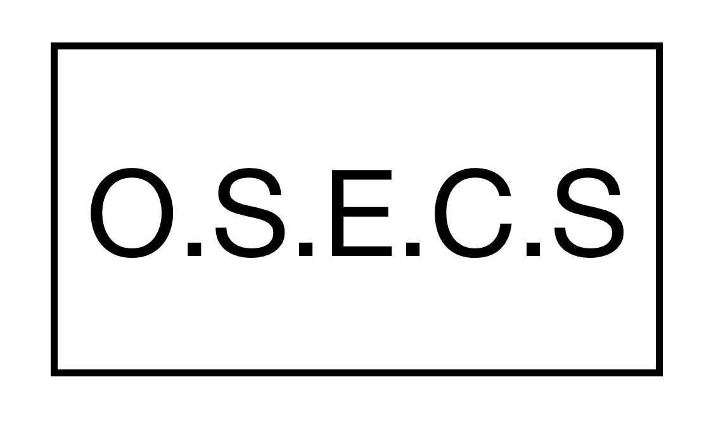
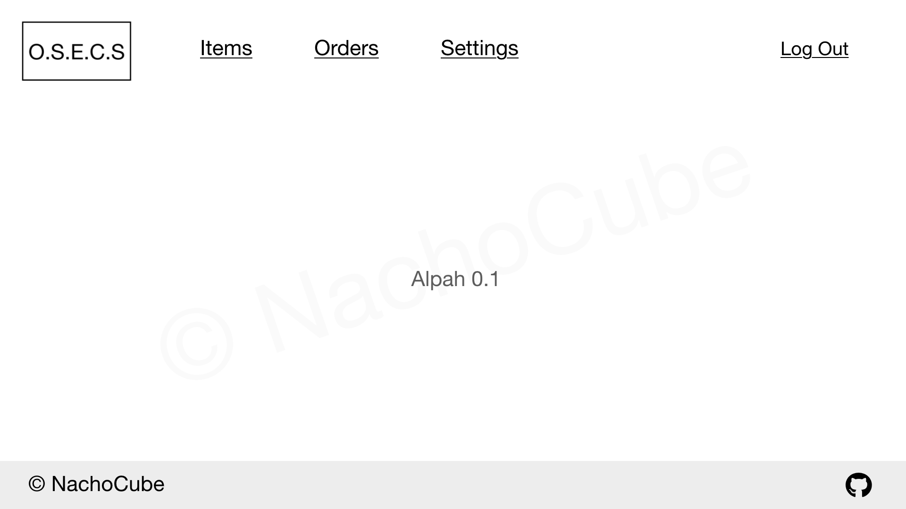

# 
The O.S.E.C.S (Open Source E-Commerce System)

OSECS is a super easy e-commerce Platform based on PHP and can be used on any• web hosting!

Features:

 ∆ Stripe And PayPal Payment intergration.
 ∆ ETC
 
⌾Sorry im really terrible at UI⌾ ☢︎(But if You Want to help out just <a href="https://instagram.com/levi.codes">DM me</a> 😄) ☢︎

•only Compatiable with web server that have html5 and PHP5
